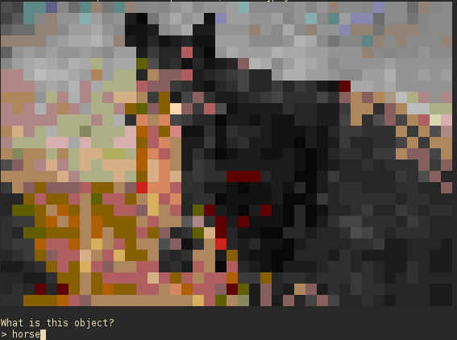

# cmdline-captcha
A command line interface for preventing bots via ascii image recognition

## Usage:
Follow the prompts. 
`$ python3 improved.py`

You'll need to download some images that are nice and recognisable (minimum of 3 per subject). Only a single photo of a windmill (`example_objects/windmill/windmill*.jpeg`) is provided.

Also included is a server version. You can run the server with `python3 server.py`, and connect to it with `nc localhost 6963`.

I recommend lowering the width of the printed image (in `improved.py` and/or `server.py`) which is supplied as an argument to `img2ansi.convert`.

## Example

## Requirements
 - python3
 - PIL (pip3 install PIL)

## TODO
 - [x] Find some site that doesn't require JS to search images. At the moment, the memory usage is quite high just because we're running a full chrome instance for this
 - [x] Larger wordbank (also try to pick ones that aren't really too ambiguous)
    - i want a larger image bank, but this is not really a TODO for this repo
 - [x] Scale the ascii down (there's probably a library to do this). The image currently doesn't fit!
    - we can now generate ascii art at any size. There is an argument to `_toAnsi` that determines how wide the image is (in img2ansi.py).
    - increasing it too much likely means that its more likely that a bot could guess what the image is
 - [x] Improve the ascii art generated, might need some image processing to increase contrast, and remove the background
    - this may be bad having too much contrast! this means that bots could make the ascii into images, and reverse img search..
 - [ ] Write this into client/server tool
 - [ ] Pluggable scramblers. I'm talking writing ^H and lots of seeking. Might require some conversion to ncurses, so we can write to the screen arbitrarily
    - pluggable, so that other people can write this stuff
    - we want scramblers to thwart people who are piping the output and stuff. of course they can reconstruct it
    - we want a module to change colours a bit, and warp the images a bit.
 - [ ] Logging, I want to know who and when, and timings for their reponses
    - my current method of lsof doesn't work.... it requires sudo rights for that

